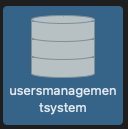
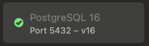
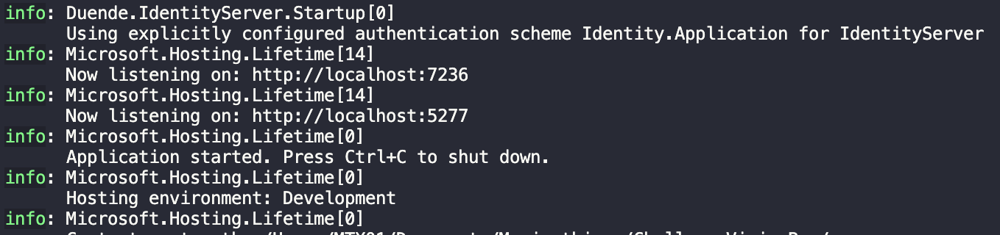

# UsersManagementSystem

Users Management System (React and .NET application)

## How to run the project:

### Pre-conditions:

I've used Postgres as database management. So, these are the steps to configure it locally:

1. Start the server

2. Double click on 'postgres' database and a terminal should pop up

3. Use the following script commands to create a new database:

  3.1. `CREATE DATABASE challengevisionbox;`

  3.2. `CREATE USER test with ENCRYPTED PASSWORD 'test';`

  3.3. `GRANT ALL PRIVILEGES ON DATABASE challengevisionbox TO test;`

  3.4. `GRANT ALL ON SCHEMA public TO test;`

4. Close the terminal

5. Now you should have a new database on your Postgre

6. Make sure the PORT used on `ConnectionStrings.DefaultConnection` inside `appsettings.Development.json` is the same as the one on your Postgre app (by default is 5432)

### Steps:

1. Clone the project

2. Open a terminal on the project folder

3. Execute the following commands:

  3.1 `cd ClientApp`

  3.2 `npm i`

  3.3 `cd ..`

  3.4 `dotnet run`

4. Open the first localhost link visible on the terminal (ex: http://localhost:7236)

